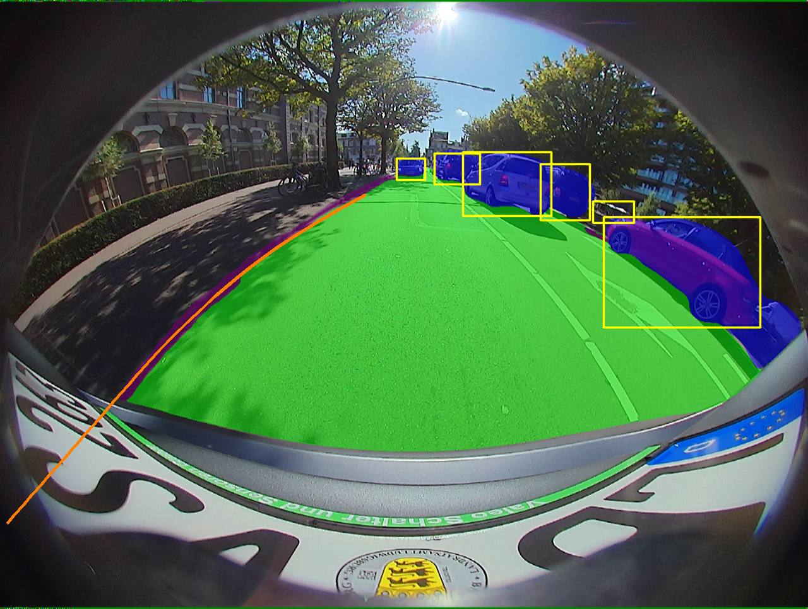
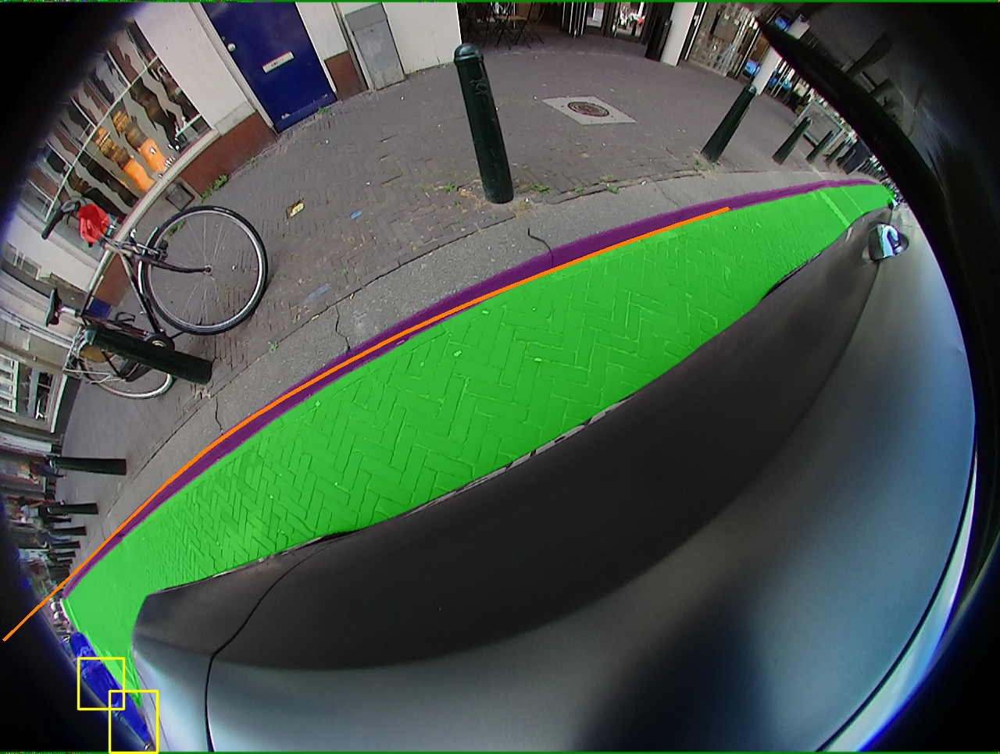
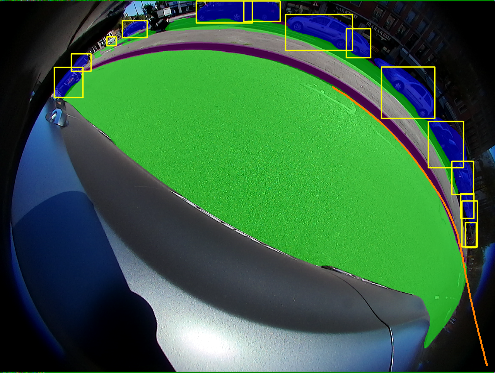

# Project Structure

```plaintext
├─lib
│ ├─config/default   # Configuration of training and validation
│ ├─core    
│ │ ├─activations.py   # Activation functions
│ │ ├─evaluate.py      # Metric calculations
│ │ ├─function.py      # Training and validation of the model
│ │ ├─general.py       # Metrics, NMS, data-format conversions, visualization
│ │ ├─loss.py          # Loss functions
│ │ ├─postprocess.py   # Refinement (unrelated to paper)
│ ├─dataset
│ │ ├─AutoDriveDataset.py   # Superclass dataset with general functions
│ │ ├─bdd.py                # Subclass dataset with specific functions
│ │ ├─convect.py 
│ │ ├─DemoDataset.py        # Demo dataset (image, video, and stream)
│ ├─models
│ │ ├─YOLOP.py        # Setup and configuration of the model
│ │ ├─YOLOX_Head.py   # YOLOX's decoupled head
│ │ ├─YOLOX_Loss.py   # YOLOX's detection loss
│ │ ├─clr_head.py     # CLRNet head
│ │ ├─clr_loss.py     # CLRNet loss
│ │ ├─commom.py       # Calculation modules
│ ├─utils
│ │ ├─augmentations.py       # Data augmentation
│ │ ├─autoanchor.py          # Auto anchor (k-means clustering)
│ │ ├─dynamic_assign.py
│ │ ├─lane.py
│ │ ├─roi_gather.py
│ │ ├─visualization.py
│ │ ├─tusimple_metric.py
│ │ ├─split_dataset.py       # Campus scene splitting (unrelated to paper)
│ │ ├─plot.py                # Plot boxes and masks
│ │ ├─utils.py               # Logging, device selection, optimizers, distributed training
│ ├─run
│ │ ├─dataset/training time  # Visualization, logging, and model saving
├─tools
│ │ ├─demo.py    # Demo for folder or camera
│ │ ├─test.py    
│ │ ├─train.py    
├─weights    # Pretrained models
```

---

# Requirements

This codebase has been developed using Python 3.7, PyTorch 1.12+, and torchvision 0.13+.

```bash
# Install using pip
pip install torch==1.12.1+cu113 torchvision==0.13.1+cu113 torchaudio==0.12.1 --extra-index-url https://download.pytorch.org/whl/cu113
```

Alternatively, use Conda:

```bash
conda install pytorch==1.12.1 torchvision==0.13.1 torchaudio==0.12.1 cudatoolkit=11.3 -c pytorch
```

For additional dependencies, refer to `requirements.txt`:

```bash
pip install -r requirements.txt
```

---

# Dataset

## WoodScape Dataset

[Google Drive Link](https://drive.google.com/drive/folders/1ltj1QSNQJhThv8DVemM_l-G-GIH3JjMb)

### Transform TXT to JSON

```bash
python tools/txt2json.py -i /path/to/original_dataset/box_2d_annotations -o /path/to/original_dataset/box_2d_json_annotations
```

### Splitting Data

```bash
python tools/data_split.py --input_rgbLabels /path/to/original_dataet/semantic_annotations/rgbLabels \
                 --input_rgbImages /path/to/original_dataset/rgb_images \
                 --input_2DBox /path/to/original_dataset/box_2d_json_annotations \
                 --output_base_dir segmented_classes \
                 --output customized_dataset \
                 --train_ratio 0.9 \
                 --num_workers 8 \
                 --copy_files
```

### Generate Curb Points

```bash
# For training
python tools/gen_regression_annotations.py --mask_dir /path/to/customized_dataset/curb_seg_annotations/train/ --image_dir /path/to/customized_dataset/rgb_images/train/ --output_json /path/to/customized_dataset/rgb_images/train.json

# For validation
python tools/gen_regression_annotations.py --mask_dir /path/to/customized_dataset/curb_seg_annotations/val/ --image_dir /path/to/customized_dataset/rgb_images/val/ --output_json /path/to/customized_dataset/rgb_images/val.json
```

---

# Recommended Dataset Structure

```plaintext
├─original_dataset # Download from source
| ├─rgb_images
| ├─box_2d_annotations
| ├─box_2d_json_annotations # Generated by txt2json.py
| ├─semantic_annotations
| │ ├─rgbLabels
| | ├─gtLabels
├─customized_dataset # Generated by data_split.py
│ ├─rgb_images
│ │ ├─train
│ │ ├─val
│ │ ├─train.json
│ │ ├─val.json
│ ├─det_annotations
│ │ ├─train
│ │ ├─val
│ ├─da_seg_annotations
│ │ ├─train
│ │ ├─val
│ ├─curb_seg_annotations
│ │ ├─train
│ │ ├─val
│ ├─person_seg_annotations
│ │ ├─train
│ │ ├─val
│ ├─vehicle_seg_annotations
│ │ ├─train
│ │ ├─val
│ ├─curb_reg_annotations
│ │ ├─train
│ │ ├─val
```

Update dataset paths in `./lib/config/default.py`.

---

# Training

```bash
python tools/train.py
```

---

# Evaluation

```bash
python tools/test.py --weights weights/epoch-195.pth
```

---

# Demo

Store images or videos in `--source` and save the output to `--save-dir`.

```bash
python tools/demo.py --weights weights/epoch-195.pth \
                     --source inference/image \
                     --save-dir inference/image_output \
                     --conf-thres 0.3 \
                     --iou-thres 0.45
```

---

# Visualization






---

# Acknowledgements

This work builds upon the contributions of the following repositories:

- [YOLOP](https://github.com/hustvl/YOLOP)
- [YOLOv5](https://github.com/ultralytics/yolov5)
- [YOLOv7](https://github.com/WongKinYiu/yolov7)
- [HybridNets](https://github.com/datvuthanh/HybridNets)
- [CLRNet](https://github.com/Turoad/CLRNet)
